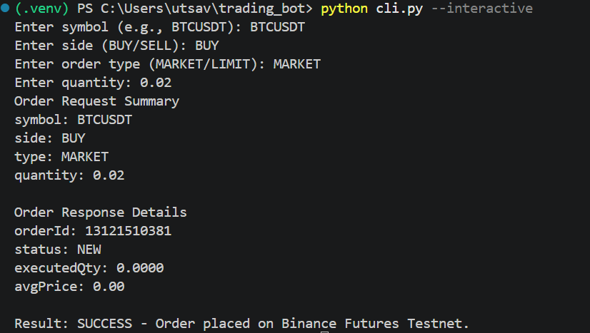
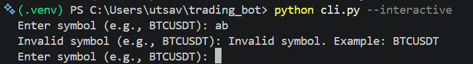
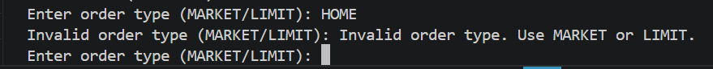
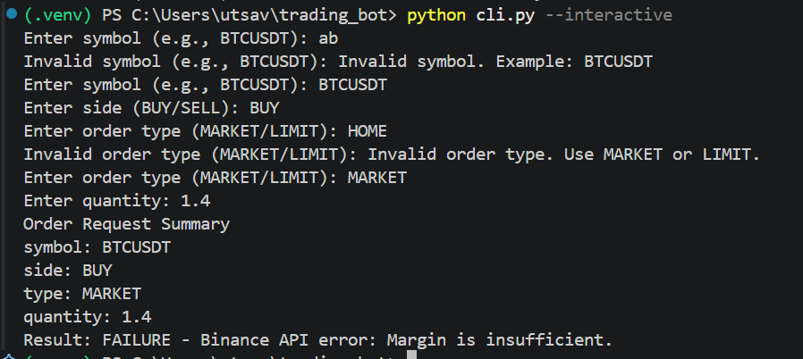

# Simplified Trading Bot (Binance Futures Testnet)

A clean, production-ready Python CLI application for placing orders on **Binance Futures Testnet (USDT-M)**. 

**Features:**
- 🎯 Place MARKET and LIMIT orders on Binance Testnet
- 📊 Support BUY and SELL order sides
- ✅ Comprehensive input validation
- 🔍 Structured logging (file-based)
- ⚠️ Robust error handling (API, network, validation)
- 🏗️ Clean, reusable code architecture
- 🎨 Interactive CLI with immediate validation

**Base URL:** `https://testnet.binancefuture.com`

---

## Table of Contents

1. [Prerequisites](#prerequisites)
2. [Usage](#usage)
3. [Installation](#installation)
4. [Configuration](#configuration)
5. [Project Structure](#project-structure)
6. [Module Documentation](#module-documentation)
7. [Logging](#logging)
8. [Error Handling](#error-handling)
9. [Assumptions](#assumptions)
10. [Troubleshooting](#troubleshooting)
11. [Bonus Features](#bonus-features)

---

## Prerequisites

### System Requirements
- **Python:** 3.10 or higher
- **OS:** Windows, macOS, or Linux
- **pip:** Python package manager

### Binance Testnet Account
1. Go to [Binance Futures Testnet](https://testnet.binancefuture.com)
2. Create an account or log in
3. Generate **API Key** and **API Secret** from Settings → API Management
   - ✅ Ensure **Futures Trading** permission is enabled
   - ✅ Consider IP whitelist for security (optional)
4. Copy both credentials securely

---
## Usage

### Command-Line Arguments

```bash
python cli.py --symbol <SYMBOL> --side <SIDE> --order-type <TYPE> --quantity <QTY> [--price <PRICE>]
```

**Arguments:**
- `--symbol` (required): Trading pair (e.g., `BTCUSDT`, `ETHUSDT`)
- `--side` (required): `BUY` or `SELL`
- `--order-type` (required): `MARKET` or `LIMIT`
- `--quantity` (required): Order quantity (must be positive)
- `--price` (required for LIMIT): Limit price (must be positive)

### Examples

#### MARKET Buy Order
```bash
python cli.py --symbol BTCUSDT --side BUY --order-type MARKET --quantity 0.001
```

**Expected Output:**
```
═══════════════════════════════════════════════════════════
Order Request Summary:
  Symbol:     BTCUSDT
  Side:       BUY
  Order Type: MARKET
  Quantity:   0.001
═══════════════════════════════════════════════════════════

[Sending order to Binance Testnet...]

Order Placed Successfully!
  Order ID:      1234567890
  Status:        FILLED
  Executed Qty:  0.001
  Average Price: 43500.00 USDT

✓ Order completed at 2026-05-09 10:30:45 UTC
```

#### MARKET Sell Order
```bash
python cli.py --symbol ETHUSDT --side SELL --order-type MARKET --quantity 0.5
```

#### LIMIT Buy Order
```bash
python cli.py --symbol BTCUSDT --side BUY --order-type LIMIT --quantity 0.001 --price 42000
```

**Expected Output:**
```
═══════════════════════════════════════════════════════════
Order Request Summary:
  Symbol:     BTCUSDT
  Side:       BUY
  Order Type: LIMIT
  Quantity:   0.001
  Price:      42000.00 USDT
═══════════════════════════════════════════════════════════

[Sending order to Binance Testnet...]

Order Placed Successfully!
  Order ID:      1234567891
  Status:        NEW
  Executed Qty:  0.0 (pending)
  Average Price: 0.0 USDT

✓ Order placed at 2026-05-09 10:31:12 UTC
ℹ️ LIMIT orders appear as NEW until they execute
```

#### LIMIT Sell Order
```bash
python cli.py --symbol ETHUSDT --side SELL --order-type LIMIT --quantity 0.5 --price 2500
```

### Interactive Mode (Bonus UX)

If you omit required arguments, the CLI enters interactive mode with live validation:

```bash
python cli.py
```

Example flow:
```
Enter symbol (e.g., BTCUSDT): BTCUSDT
Enter side (BUY/SELL): BUY
Enter order type (MARKET/LIMIT): LIMIT
Enter quantity: 0.001
Enter price: 42000

[Processing order...]
Order Placed Successfully!
```

Each input is validated immediately. Invalid input shows an error message and re-prompts for that field.




---

## Installation

### Step 1: Clone or Download the Repository

```bash
git clone <your-repo-url>
cd trading_bot
```

### Step 2: Create a Virtual Environment

```bash
# Windows (PowerShell/CMD)
python -m venv .venv
.\.venv\Scripts\Activate.ps1

# macOS/Linux
python3 -m venv .venv
source .venv/bin/activate
```

### Step 3: Install Dependencies

```bash
pip install -r requirements.txt
```

### Step 4: Verify Installation

```bash
python cli.py --help
```

Expected output: Help text with all available CLI options.

---

## Configuration

### Set API Credentials

Set environment variables with your Testnet credentials:

#### Windows (PowerShell)
```powershell
$env:BINANCE_API_KEY="your_testnet_api_key"
$env:BINANCE_API_SECRET="your_testnet_api_secret"
```

#### Windows (Command Prompt)
```cmd
set BINANCE_API_KEY=your_testnet_api_key
set BINANCE_API_SECRET=your_testnet_api_secret
```

#### macOS/Linux (Bash)
```bash
export BINANCE_API_KEY="your_testnet_api_key"
export BINANCE_API_SECRET="your_testnet_api_secret"
```

#### Persistent Setup (macOS/Linux)
Add to `~/.bashrc` or `~/.zshrc`:
```bash
export BINANCE_API_KEY="your_testnet_api_key"
export BINANCE_API_SECRET="your_testnet_api_secret"
```

Then reload: `source ~/.bashrc`

#### Persistent Setup (Windows PowerShell)
Add to PowerShell profile (`$PROFILE`):
```powershell
$env:BINANCE_API_KEY="your_testnet_api_key"
$env:BINANCE_API_SECRET="your_testnet_api_secret"
```
---

## Project Structure

```
trading_bot/
├── bot/
│   ├── __init__.py              # Package initialization
│   ├── client.py                # Binance API client wrapper
│   ├── orders.py                # Order placement logic
│   ├── validators.py            # Input validation functions
│   ├── exceptions.py            # Custom exception classes
│   └── logging_config.py        # Logging configuration
├── cli.py                       # CLI entry point (argparse)
├── README.md                    # This file
├── requirements.txt             # Python dependencies
└── logs/                        # Log output directory
    ├── trading_bot.log          # Main application log
    ├── market_order.log         # Sample MARKET order execution
    └── limit_order.log          # Sample LIMIT order execution
```

---

## Module Documentation

### `bot/client.py`
**BinanceClient**: Wrapper around Binance Futures Testnet REST API

- `__init__(api_key, api_secret)`: Initialize with credentials
- `place_order(symbol, side, order_type, quantity, price=None)`: Place an order
- Methods handle authentication, request signing, and error handling

**Key Features:**
- Automatic HMAC-SHA256 request signing
- Timestamp synchronization with Binance servers
- Timeout handling (default 10 seconds)

---

### `bot/orders.py`
**Order Placement Logic**: High-level order operations

- Validates input before API calls
- Formats requests per Binance specification
- Parses and returns clean response data

---

### `bot/validators.py`
**Input Validation Functions**

- `validate_symbol(symbol)`: Checks symbol format (e.g., `BTCUSDT`)
- `validate_side(side)`: Ensures `BUY` or `SELL`
- `validate_order_type(order_type)`: Ensures `MARKET` or `LIMIT`
- `validate_quantity(quantity)`: Checks for positive number
- `validate_price(price)`: Checks for positive number

**Validation Rules:**
- Symbol: Non-empty string, uppercase, alphanumeric
- Side: Exactly `BUY` or `SELL` (case-insensitive)
- Order Type: Exactly `MARKET` or `LIMIT` (case-insensitive)
- Quantity: Positive float/int
- Price: Positive float/int (required for LIMIT orders)

---

### `bot/exceptions.py`
**Custom Exceptions**

- `BinanceAPIError`: API returned error (invalid symbol, insufficient balance, etc.)
- `ValidationError`: User input validation failed
- `NetworkError`: Connection/timeout issue

---

### `bot/logging_config.py`
**Logging Setup**

- Configures file-based logging to `logs/trading_bot.log`
- Log level: `INFO` (captures important events and errors)
- Format: `[TIMESTAMP] [LEVEL] [MODULE] MESSAGE`

---

### `cli.py`
**Command-Line Interface Entry Point**

- Uses `argparse` for argument parsing
- Implements interactive mode when arguments are missing
- Formats and displays order response to user
- Exits gracefully on error

---

## Logging

### Log File Location
```
logs/trading_bot.log
```

### What Gets Logged

#### API Requests
```
[2026-05-09 10:30:45,123] [INFO] [bot.client] Sending POST request to /fapi/v1/order
  Params: symbol=BTCUSDT, side=BUY, type=MARKET, quantity=0.001
```

#### API Responses
```
[2026-05-09 10:30:46,456] [INFO] [bot.orders] Order response: {
  'orderId': 1234567890,
  'status': 'FILLED',
  'executedQty': '0.001',
  'avgPrice': '43500.00'
}
```

#### Errors
```
[2026-05-09 10:31:00,789] [ERROR] [bot.client] API Error: Invalid symbol
```

### Sample Log Files
- `logs/market_order.log`: Example MARKET order execution
- `logs/limit_order.log`: Example LIMIT order execution

### View Logs
```bash
# View live logs (Windows)
Get-Content logs/trading_bot.log -Tail 20

# View live logs (macOS/Linux)
tail -f logs/trading_bot.log
```

---

## Error Handling

### Validation Errors
**Scenario:** Invalid input (e.g., negative quantity)

**Behavior:** Application shows error message and exits

```
❌ Validation Error: Quantity must be positive.
```

### API Errors
**Scenario:** Binance returns error (e.g., insufficient balance, invalid symbol)

**Behavior:** Error logged, specific message displayed

```
❌ API Error: Insufficient balance for order.
```

### Network Errors
**Scenario:** Connection timeout or server unavailable

**Behavior:** Retry logic (configurable) with informative message

```
❌ Network Error: Connection timeout. Please check your internet connection.
```

### Missing Credentials
**Scenario:** API key/secret not set as environment variables

**Behavior:** Error message guides user to set credentials

```
❌ Missing API Credentials: Set BINANCE_API_KEY and BINANCE_API_SECRET environment variables.
```

---

## Assumptions

1. **Python Version:** Python 3.10+ is available and used
2. **Testnet Account:** User has an active Binance Futures Testnet account
3. **API Permissions:** Generated API key has **Futures Trading** permission enabled
4. **Symbol Validity:** User provides a valid trading pair (e.g., `BTCUSDT`, `ETHUSDT`)
   - The app validates format but relies on Binance for specific symbol existence
5. **Network Connectivity:** Stable internet connection to reach `https://testnet.binancefuture.com`
6. **System Time:** Computer clock is reasonably synchronized (Binance enforces timestamp validation)
7. **Precision:** Binance symbol filters (precision, min notional, etc.) are enforced server-side
   - This app validates generic input format only
8. **Security:** API credentials are not committed to version control; use environment variables

---

## Troubleshooting

### ❌ "ModuleNotFoundError: No module named 'requests'"
**Solution:** Install dependencies
```bash
pip install -r requirements.txt
```

### ❌ "Missing API Credentials"
**Solution:** Set environment variables (see [Configuration](#configuration))

### ❌ "Invalid API key / Invalid Signature"
**Causes:**
- Wrong API key or secret
- Testnet account doesn't have Futures permission enabled

**Solution:**
- Verify credentials in Binance Futures Testnet dashboard
- Ensure API key is **for Testnet** (not production Binance)

### ❌ "Bad Request: Invalid symbol"
**Causes:**
- Symbol doesn't exist (e.g., `BTCUDT` instead of `BTCUSDT`)
- Symbol not available on USDT-M Futures

**Solution:**
- Check symbol on [Binance Testnet](https://testnet.binancefuture.com)
- Verify correct spelling

### ❌ "Insufficient balance"
**Causes:**
- Account balance too low for order
- Margin requirements not met

**Solution:**
- Deposit USDT into testnet account via faucet
- Reduce order quantity

### ❌ "Connection timeout"
**Causes:**
- Internet connection issue
- Binance server temporarily unavailable
- Firewall blocking connection

**Solution:**
- Check internet connection
- Wait a few moments and retry
- Try another trading pair to isolate issue

### ❌ "Invalid arguments" when running CLI
**Solution:** Use `--help` to see correct syntax
```bash
python cli.py --help
```

---

## Bonus Features

### 1. Interactive Mode ✅
Run without arguments to enter interactive mode with live field validation:
```bash
python cli.py
```

### 2. Enhanced CLI UX ✅
- Clear, formatted order summaries
- Real-time validation feedback
- Color-coded success/error messages
- Timestamp tracking

### 3. Comprehensive Logging ✅
- Request/response payloads logged
- Error details captured for debugging
- Organized log files in `logs/` directory

---

## Development Notes

### Adding New Features

#### Adding a New Order Type (e.g., Stop-Limit)
1. Update `bot/validators.py` to accept new type
2. Extend `bot/orders.py` with new order logic
3. Update CLI help text in `cli.py`

#### Adding Websocket Support
1. Create `bot/websocket.py` for real-time order updates
2. Integrate into main CLI flow

#### Adding a GUI
1. Consider frameworks: `tkinter`, `PyQt`, or web-based (`Flask` + React)
2. Reuse `bot/` modules for business logic

---

## Support

For issues, questions, or contributions:
1. Check [Troubleshooting](#troubleshooting) section
2. Review logs in `logs/trading_bot.log`
3. Open an issue on GitHub (if applicable)

---


## Disclaimer

⚠️ **This is a testnet application.** It connects to Binance Futures Testnet with virtual funds. Real fund trading requires additional considerations (risk management, order validation, etc.). Use at your own risk.

---

**Last Updated:** May 9, 2026  
**Version:** 1.0.0

